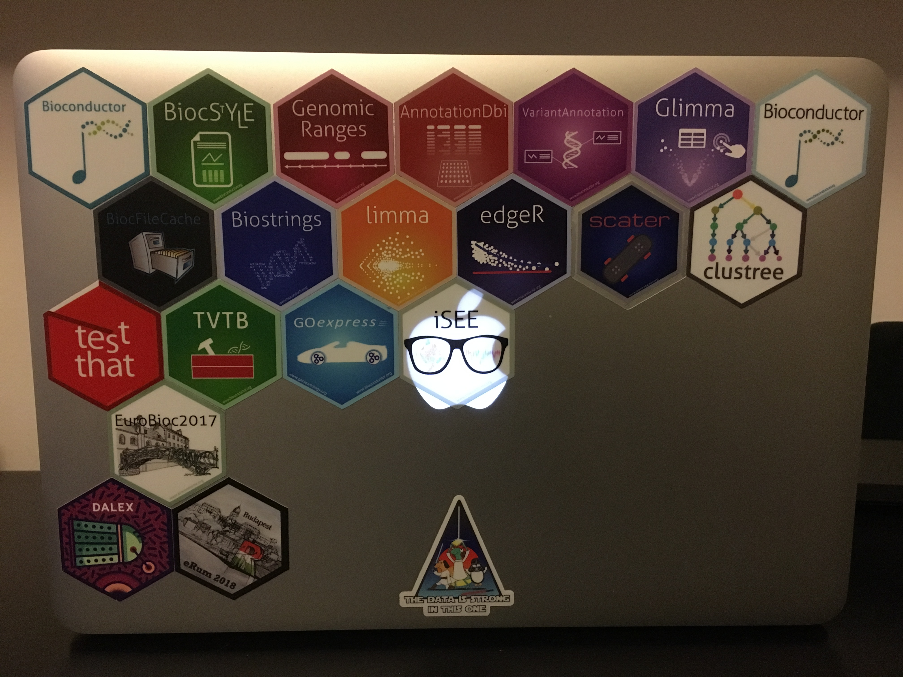
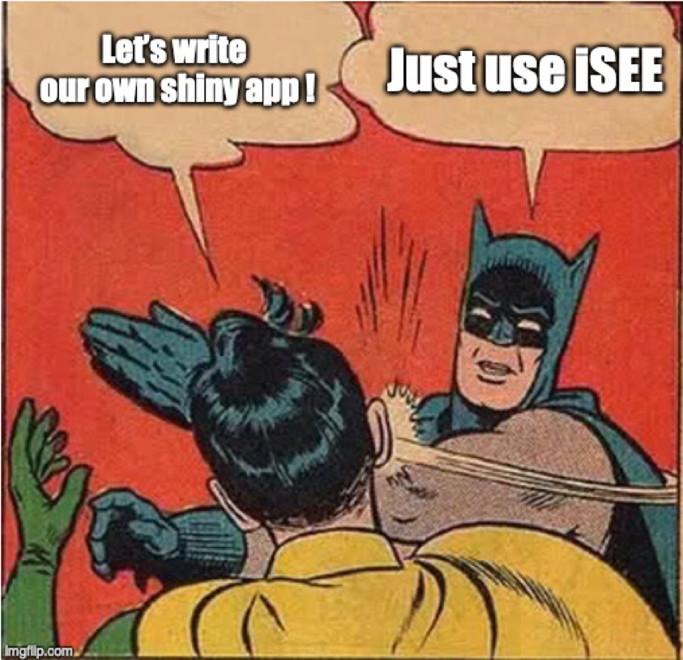
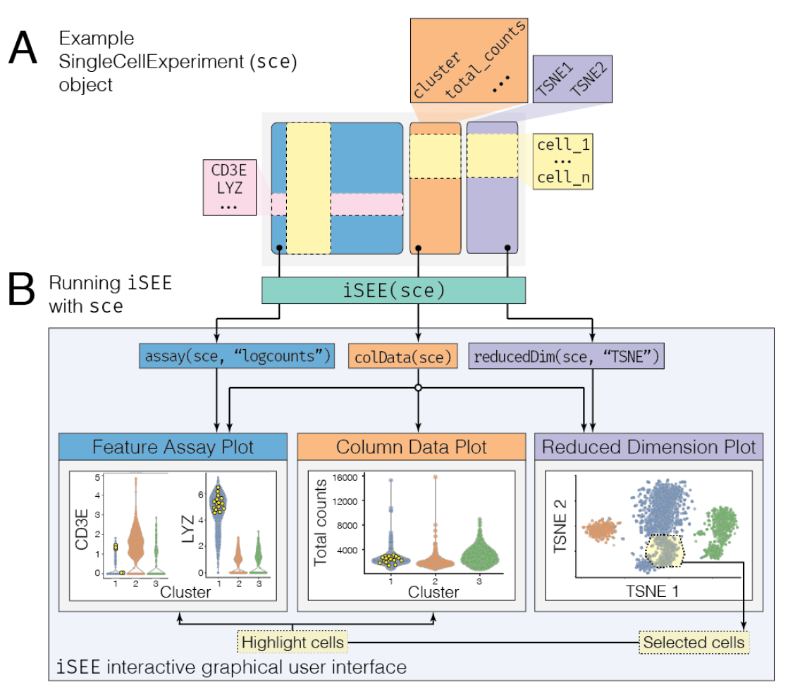
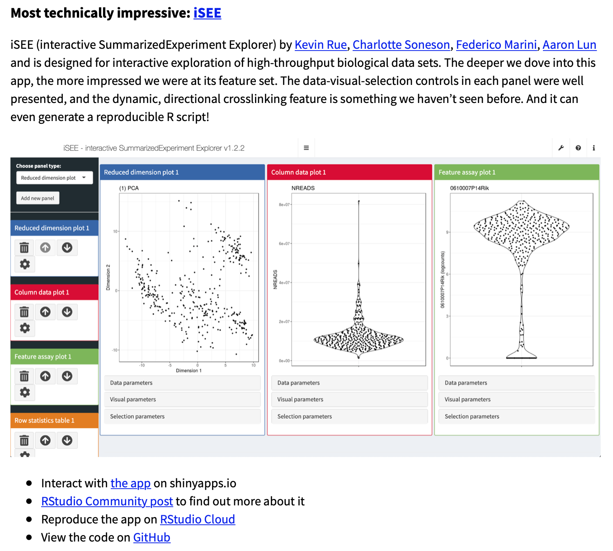

layout: true

<div class="my-header"></div>

<div class="my-footer"><span>
iSEE Workshop 2020
&emsp;&emsp;&emsp;&emsp;&emsp;&emsp;&emsp;&emsp;
interactive SummarizedExperiment Explorer
</span></div>

```{r setup, include=FALSE}
stopifnot(require(iSEE))
stopifnot(require(htmltools))
stopifnot(require(RefManageR))
stopifnot(require(knitr))
```

```{r htmltools, include=FALSE}
stopifnot(requireNamespace("htmltools"))
htmltools::tagList(rmarkdown::html_dependency_font_awesome())
```

```{r, load_refs, include=FALSE, cache=FALSE}
options(htmltools.dir.version = FALSE)
BibOptions(
  check.entries = FALSE,
  bib.style = "authoryear",
  cite.style = "authoryear",
  max.names = 2,
  style = "markdown",
  hyperlink = "to.doc",
  dashed = TRUE)
bib <- ReadBib("references.bib")
```

---

# The team

<br/>

<table>
<tr>
<td width="25%"><a href="https://kevinrue.github.io"></a></td>
<td width="25%"><a href="https://csoneson.github.io"></a></td>
<td width="25%"><a href="https://federicomarini.github.io"></a></td>
<td width="25%"><a href="https://orcid.org/0000-0002-3564-4813"></a></td>
</tr>
<tr>
<td align='center' width="25%">Kevin</td>
<td align='center' width="25%">Charlotte</td>
<td align='center' width="25%">Federico</td>
<td align='center' width="25%">Aaron</td>
</tr>
</table>

```{r, include=FALSE}
NoCite(bib, "rue2018isee")
```

???

This was a team effort!

---

# Designed for Bioconductor

```{r, fig.align='center', out.width='75%',  echo=FALSE}

```

<https://bioconductor.org>

???

iSEE tightly integrates with other packages of the Bioconductor project.

---

# Original wishlist (1 / 2)

- An interactive user interface for exploring data in `r BiocStyle::Biocpkg("SummarizedExperiment")`

- Particular focus given to single-cell data in the `r BiocStyle::Biocpkg("SingleCellExperiment")` derived class

- Sample-oriented visualizations (e.g., patients, cells)

- Feature-oriented visualizations (e.g., genes, protein, metabolites, loci, variants)

- Heatmaps (cells _and_ features)

- Selectable points

???

When we sat down at EuroBioc2017, we drafted a wishlist of features.
See commit #3 at https://github.com/csoneson/iSEE/tree/021e3e20cfdb194e511f8097ed544329bd46bcd6

---

# Original wishlist (2 / 2)

- Colouring of samples by metadata or assayed values

- Stratify axes and facets by metadata (e.g., violin plots)

- Hover and click

- Zoom

- Transmission of points selections between plots

- Code tracking for reproducibility and batch generation of figures

???

When we sat down at EuroBioc2017, we drafted a wishlist of features.
See commit #3 at https://github.com/csoneson/iSEE/tree/021e3e20cfdb194e511f8097ed544329bd46bcd6

---

# SingleCellExperiment

```{r, fig.align='center', out.height='400px', echo=FALSE}
knitr::include_graphics("img/OSCA/bioc-figures_v2-02.png")
```

`r Citet(bib, "amezquita2020osca")`

???

iSEE focuses on the SingleCellExperiment class.
This class stores all the data and metadata associated with assays, cells, and features.

---

# Usage in a workflow

.pull-left[
- Add

- Points

- Here
]

.pull-right[
```{r, fig.align='center', echo=FALSE}
knitr::include_graphics("img/OSCA/bioc-figures_v2-03.png")
```

.right[
`r Citet(bib, "amezquita2020osca")`
]
]

???

The SingleCellExperiment class is designed to accomodate all the information produced along a typical single-cell analysis workflow.

Those data include raw data:

- raw assay data
- experimental metadata
Processed data:
- quality control metrics
- normalized data
- dimensionality reduction results
Downstream analyses:
- cluster labels
- differential expression results
- downstream cell and feature annotations

---

# Warning: Reinventing the wheel

```{r, fig.align='center', out.width='50%', echo=FALSE}

```

See also: <i class="fab fa-github"></i> [federicomarini/awesome-expression-browser](https://github.com/federicomarini/awesome-expression-browser)

???

Don't try this at home.

The wealth of information produced by single-cell analysis workflows has motivated the development of many interactive applications to help researchers explore their data sets.
Each of those applications has its own strengths and limitations.
It is very tempting to develop new applications to with their own strengths and limitations.
Before you decide to do so, we encourage you to test iSEE.
You may find that it already does everything you would like!

---

# Interfacing with SingleCellExperiment

```{r, fig.align='center', out.width='60%', echo=FALSE}

```

`r Citet(bib, "amezquita2020osca")`

???

Here we demonstrate how iSEE dissects SCE objects to produce figures.

---

# The iSEE interface

```{r, fig.align='center', out.width='100%', echo=FALSE}
knitr::include_graphics("img/screenshots/iSEE_screenshot.png")
#knitr::include_graphics("https://raw.githubusercontent.com/kevinrue/iSEEWorkshop2019/master/inst/vignettes/img/iSEEinterface.png")
```

???

iSEE provides a powerful yet flexible user interface that includes 8 predefined panel types.
That said, it also gives the freedom to define any number custom panel types, both plots and tables.

---

# Live demo

```{r, fig.align='center', echo=FALSE}
knitr::include_graphics("img/misc/workshop.png")
```

Generated by: <i class="fab fa-github"></i> [kevinrue/magick-profile](https://github.com/kevinrue/magick-profile)

???

With that introduction to the user interface, let us head into the workshop!

---

# Voice recognition

.center[`iSEE(sce, voice=TRUE)`]

<div style="position: relative; padding-bottom: 56.25%; height: 0; overflow: hidden;">
  <iframe src="https://www.youtube.com/embed/0crFZLwAJOE?autoplay=0" style="position: absolute; top: 0; left: 0; width: 100%; height: 90%; border:0;" allowfullscreen title="YouTube Video"></iframe>
</div>

???

iSEE can be extended using third-party JavaScript libraries.
Here we demonstrate how speech recognition was integrated to support a number of predefined vocal commands.

---

# Winners of the 1st Rstudio Shiny Contest

```{r, fig.align='center', out.width='60%', echo=FALSE}

```

Read more: <https://blog.rstudio.com/2019/04/05/first-shiny-contest-winners/>

???

iSEE won the RStudio Shiny Contest in April 2019 with mention for "Most technically impressive".

In particular:

- There were 136 submissions from 122 unique app developers!

---

# Creating an ExperimentColorMap

```{r}
qc_color_fun <- function(n){
    qc_colors <- c("forestgreen", "firebrick1")
    names(qc_colors) <- c("Y", "N")
    qc_colors
}
```

```{r}
ecm <- ExperimentColorMap(
    assays = list(counts = viridis::viridis, logcounts = viridis::viridis),
    colData = list(passes_qc_checks_s = qc_color_fun),
    all_continuous = list(assays = viridis::plasma),
    global_continuous = viridis::viridis
)
```

---

# Using an ExperimentColorMap

```{r}
colDataColorMap(ecm, "passes_qc_checks_s", discrete=TRUE)
```

---

# How iSEE uses the ExperimentColorMap

.small-code[
```{r, eval=FALSE}
red.dim <- reducedDim(se, "PCA");
plot.data <- data.frame(X=red.dim[, 1], Y=red.dim[, 2], row.names=colnames(se));

plot.data$ColorBy <- colData(se)[, "driver_1_s"];
plot.data[["ColorBy"]] <- factor(plot.data[["ColorBy"]]);

# Avoid visual biases from default ordering by shuffling the points
set.seed(379);
plot.data <- plot.data[sample(nrow(plot.data)),,drop=FALSE];

dot.plot <- ggplot() +
    geom_point(aes(x=X, y=Y, color=ColorBy), alpha=1, plot.data, size=1) +
    labs(x="Dimension 1", y="Dimension 2", color="driver_1_s", title="PCA") +
    coord_cartesian(xlim=range(plot.data$X, na.rm=TRUE),
        ylim=range(plot.data$Y, na.rm=TRUE), expand=TRUE) +
    scale_color_manual(values=colDataColorMap(colormap, "driver_1_s", discrete=TRUE)(3), na.value='grey50', drop=FALSE) +
    scale_fill_manual(values=colDataColorMap(colormap, "driver_1_s", discrete=TRUE)(3), na.value='grey50', drop=FALSE) +
    theme_bw() +
    theme(legend.position='bottom', legend.box='vertical', legend.text=element_text(size=9),
          legend.title=element_text(size=11), axis.text=element_text(size=10),
          axis.title=element_text(size=12), title=element_text(size=12))
```
]

---

# The iSEE-verse

* http://bioconductor.org/packages/iSEE/

* <i class="fab fa-github"></i> [iSEE](https://github.com/iSEE) organization
  + <i class="fab fa-github"></i> [iSEE/iSEE2018](https://github.com/iSEE/iSEE2018) manuscript
  + <i class="fab fa-github"></i> [iSEE/iSEE](https://github.com/iSEE/iSEE) source code
  + <i class="fab fa-github"></i> [iSEE/iSEE_custom](https://github.com/iSEE/iSEE_custom) example of custom panels
  + <i class="fab fa-github"></i> [iSEE/iSEE_instances](https://github.com/iSEE/iSEE_instances) gallery of complete analyses on public data
  + <i class="fab fa-github"></i> [iSEE/iSEEWorkshop2019](https://github.com/iSEE/iSEEWorkshop2019) workshop at the Bioconductor 2019 conference

???

The growing funtionality of the iSEE package is demonstrated in various places:

- The Bioconductor website is the primary source of information for the latest release and development package versions.
- The package GitHub repository is the place to monitor the latest developments, open issues, and contribute pull requests (consider the Bioconductor support website for general questions)
- kevinrue/iSEE_custom demonstrates the development of custom panels through a gallery of examples
- federicomarini/iSEE_instances demonstrates the integration of iSEE with entire analyses of publicly available datasets through a gallery of examples
- Finally, the iSEE workshop was written for the Bioconductor conference 2019 to showcase the functionality of the iSEE package for both newcomers and experienced R users.

---

# References

.small-p[
```{r, include=TRUE, echo=FALSE, results="asis"}
PrintBibliography(bib)
```
]


<!-- F1000 Twitter teaser -->
<!--  -->