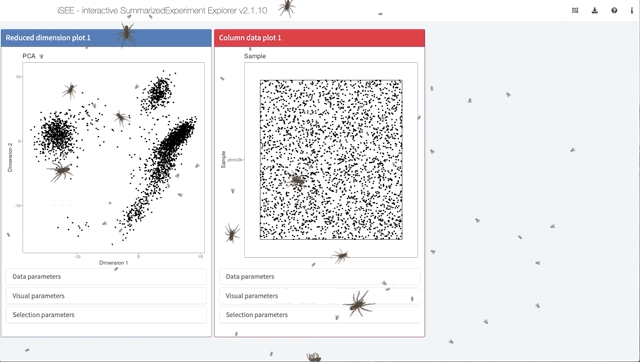

layout: true

<div class="my-header"></div>

<div class="my-footer"><span>
iSEE Workshop 2020
&emsp;&emsp;&emsp;&emsp;&emsp;&emsp;&emsp;&emsp;
interactive SummarizedExperiment Explorer
</span></div>

```{r setup, include=FALSE}
stopifnot(require(iSEE))
stopifnot(require(htmltools))
stopifnot(require(RefManageR))
stopifnot(require(knitr))
```

```{r htmltools, include=FALSE}
stopifnot(requireNamespace("htmltools"))
htmltools::tagList(rmarkdown::html_dependency_font_awesome())
```

```{r, load_refs, include=FALSE, cache=FALSE}
options(htmltools.dir.version = FALSE)
BibOptions(
  check.entries = FALSE,
  bib.style = "authoryear",
  cite.style = "authoryear",
  max.names = 2,
  style = "markdown",
  hyperlink = "to.doc",
  dashed = TRUE)
bib <- ReadBib("references.bib")
```

---

# <i class="fas fa-bullhorn"></i> Disclaimer

_This presentation contains slides that some viewers may find disturbing ..._

.right[
... _or greatly entertaining!_
]

---

# <i class="fas fa-users"></i> The team

<br/>

<table>
<tr>
<td width="25%"><a href="https://kevinrue.github.io"></a></td>
<td width="25%"><a href="https://csoneson.github.io"></a></td>
<td width="25%"><a href="https://federicomarini.github.io"></a></td>
<td width="25%"><a href="https://orcid.org/0000-0002-3564-4813"></a></td>
</tr>
<tr>
<td align='center' width="25%">Kevin</td>
<td align='center' width="25%">Charlotte</td>
<td align='center' width="25%">Federico</td>
<td align='center' width="25%">Aaron</td>
</tr>
</table>

```{r, include=FALSE}
NoCite(bib, "rue2018isee")
```

???

This was a team effort!

---

# <i class="fas fa-pencil-ruler"></i> Designed for Bioconductor

```{r, fig.align='center', out.width='75%',  echo=FALSE}
knitr::include_graphics("img/stickers/biocstickers.jpg")
```

<https://bioconductor.org>

???

iSEE tightly integrates with other packages of the Bioconductor project.

---

# SingleCellExperiment

```{r, fig.align='center', out.height='400px', echo=FALSE}
knitr::include_graphics("img/OSCA/bioc-figures_v2-02.png")
```

.footnote[
`r Citet(bib, "amezquita2020osca")`
]

???

iSEE focuses on the SingleCellExperiment class.
This class stores all the data and metadata associated with assays, cells, and features.

---

# SingleCellExperiment usage in a workflow

.pull-left[
- Data import (`DropletUtils`, `tximeta`)

- Quality control (`scater`)

- Normalization, feature selection (`scran`, `zinbwave`)

- Dimensionality reduction (`BiocSingular`, `scater`, `zinbwave`)

- Clustering (`SC3`, `clustree`)

- Marker gene detection (`scran`, `scDD`)

- Trajectory inference (`slingshot`)

- Visualization (`iSEE`)

- And much more...
]

.pull-right[
```{r, fig.align='center', echo=FALSE}
knitr::include_graphics("img/OSCA/bioc-figures_v2-03.png")
```

.right[
`r Citet(bib, "amezquita2020osca")`
]
]

???

The SingleCellExperiment class is designed to accomodate all the information produced along a typical single-cell analysis workflow.

Those data include raw data:

- raw assay data
- experimental metadata
Processed data:
- quality control metrics
- normalized data
- dimensionality reduction results
Downstream analyses:
- cluster labels
- differential expression results
- downstream cell and feature annotations

---

# iSEE <i class="fas fa-heartbeat"></i> SingleCellExperiment

```{r, fig.align='center', out.width='60%', echo=FALSE}
knitr::include_graphics("img/OSCA/OSCA-figure-4.png")
```

.footnote[
`r Citet(bib, "amezquita2020osca")`
]

???

Here we demonstrate how iSEE dissects SCE objects to produce figures.

---

# The iSEE interface

```{r, fig.align='center', out.width='100%', echo=FALSE}
knitr::include_graphics("img/screenshots/iSEE_screenshot.png")
#knitr::include_graphics("https://raw.githubusercontent.com/kevinrue/iSEEWorkshop2019/master/inst/vignettes/img/iSEEinterface.png")
```

???

iSEE provides a powerful yet flexible user interface that includes 8 predefined panel types.
That said, it also gives the freedom to define any number custom panel types, both plots and tables.

---

# <i class="fas fa-exclamation-triangle"></i> Reinventing the wheel

```{r, fig.align='center', out.width='50%', echo=FALSE}
knitr::include_graphics("img/misc/batman-robin.png")
```

.footnote[
See also: <i class="fab fa-github"></i> [federicomarini/awesome-expression-browser](https://github.com/federicomarini/awesome-expression-browser)
]

???

Don't try this at home.

The wealth of information produced by single-cell analysis workflows has motivated the development of many interactive applications to help researchers explore their data sets.
Each of those applications has its own strengths and limitations.
It is very tempting to develop new applications to with their own strengths and limitations.
Before you decide to do so, we encourage you to test iSEE.
You may find that it already does everything you would like!

---

# <i class="fas fa-laptop"></i> Live demo

```{r, fig.align='center', echo=FALSE, out.height='300px', out.width='600px'}
knitr::include_graphics("img/misc/workshop.png")
```

## Resources

- [Workshop setup](https://isee.github.io/iSEEWorkshop2020/articles/setup.html),
  or `vignette('setup', 'iSEEWorkshop2020')`

- [Workshop vignette](https://isee.github.io/iSEEWorkshop2020/articles/iSEE-lab.html),
  or, `vignette('iSEE-lab', 'iSEEWorkshop2020')`

???

With that introduction to the user interface, let us head into the workshop!

Generated by: <i class="fab fa-github"></i> [kevinrue/magick-profile](https://github.com/kevinrue/magick-profile)

---

# <i class="fas fa-medal"></i> Winners of the 1st Rstudio Shiny Contest

```{r, fig.align='center', out.width='60%', echo=FALSE}
knitr::include_graphics("https://d33wubrfki0l68.cloudfront.net/9a02c0a6f476893b0ecbed9738d8485750c12fff/0528f/images/2019-01-07-shiny-contest.png")
```

.footnote[
Read more: <https://blog.rstudio.com/2019/04/05/first-shiny-contest-winners/>
]

???

iSEE won the RStudio Shiny Contest in April 2019 with mention for "Most technically impressive".

In particular:

- There were 136 submissions from 122 unique app developers!

---

# <i class="fas fa-microphone"></i> Voice recognition

.center[`iSEE(sce, voice=TRUE)`]

<div style="position: relative; padding-bottom: 56.25%; height: 0; overflow: hidden;">
  <iframe src="https://www.youtube.com/embed/0crFZLwAJOE?autoplay=0" style="position: absolute; top: 0; left: 0; width: 100%; height: 90%; border:0;" allowfullscreen title="YouTube Video"></iframe>
</div>

???

iSEE can be extended using third-party JavaScript libraries.
Here we demonstrate how speech recognition was integrated to support a number of predefined vocal commands.

---

# <i class="fas fa-bug"></i> Bugs

.center[`iSEE(sce, bugs=TRUE)`]

```{r, fig.align='center', out.width='90%', echo=FALSE}

```

???

iSEE can be extended using third-party JavaScript libraries.
Here we demonstrate how speech recognition was integrated to support a number of predefined vocal commands.

---

# <i class="fas fa-globe-americas"></i> The iSEE-verse

* http://bioconductor.org/packages/iSEE/

* http://bioconductor.org/packages/iSEEu/

* <i class="fab fa-github"></i> [iSEE](https://github.com/iSEE) organization
  + <i class="fab fa-github"></i> [iSEE/iSEE2018](https://github.com/iSEE/iSEE2018) manuscript
  + <i class="fab fa-github"></i> [iSEE/iSEE](https://github.com/iSEE/iSEE) source code
  + <i class="fab fa-github"></i> [iSEE/iSEE-book](https://github.com/iSEE/iSEE-book) repository for the book about extending iSEE
  + <i class="fab fa-github"></i> [iSEE/iSEEu](https://github.com/iSEE/iSEEu) source code for iSEEu, containing additional panels and modes for iSEE
  + <i class="fab fa-github"></i> [iSEE/iSEE_custom](https://github.com/iSEE/iSEE_custom) example of custom panels
  + <i class="fab fa-github"></i> [iSEE/iSEE_instances](https://github.com/iSEE/iSEE_instances) gallery of complete analyses on public data
  + <i class="fab fa-github"></i> [iSEE/iSEEWorkshop2020](https://github.com/iSEE/iSEEWorkshop2020) this workshop, also to be given at the Bioconductor 2020 conference

???

The growing funtionality of the iSEE package is demonstrated in various places:

- The Bioconductor website is the primary source of information for the latest release and development package versions.
- The package GitHub repository is the place to monitor the latest developments, open issues, and contribute pull requests (consider the Bioconductor support website for general questions)
- kevinrue/iSEE_custom demonstrates the development of custom panels through a gallery of examples
- federicomarini/iSEE_instances demonstrates the integration of iSEE with entire analyses of publicly available datasets through a gallery of examples
- Finally, the iSEE workshop was written for the Bioconductor conference 2019 to showcase the functionality of the iSEE package for both newcomers and experienced R users.

---

# References

.small-p[
```{r, include=TRUE, echo=FALSE, results="asis"}
PrintBibliography(bib)
```
]

<!-- F1000 Twitter teaser -->
<!--  -->